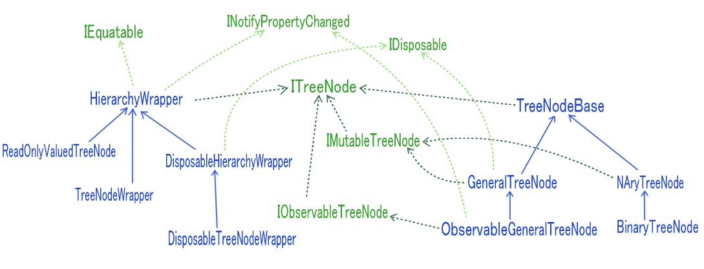
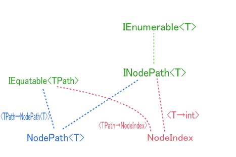

# Introduction
This is a C# library designed to efficiently handle tree structures.  
It emphasizes flexibility and extensibility, making it easy to manipulate various tree structures.

## Features
1. A rich set of extension methods for `ITreeNode<TNode>`
2. Mutual referencing between parent and child nodes
3. A collection of tree-structured classes with high extensibility
4. Conversion between different data structures and tree structures
5. Collection-related classes developed as a byproduct of implementing the above

## Usage
Refer to the [wiki](https://github.com/Houzkin/TreeStructures/wiki/).

## Concept
This library is not intended to be a standalone solution.  
Instead, it provides tree-related functionality while being designed to coexist with other libraries.

Below is a detailed explanation of its key features.

### Rich Extension Methods
More than 60 extension methods, including overloads, are defined for `ITreeNode<TNode>`.  
Some examples:

- **Enumeration**: `Preorder`, `Levelorder`, all traversal methods, `Leafs`, `Ancestors`, `DiscendArrivals`, `DescendTraces`, etc.
- **Navigation**: `Root`, `NextSibling`, `LastSibling`, etc.
- **Modification**: `TryAddChild`, `Try○○Child`, `Disassemble`, `RemoveAllDescendant`, etc.
- **Parameter Retrieval**: `NodeIndex`, `NodePath`, `Height`, `Depth`, etc.
- **Validation**: `IsDescendantOf`, `IsAncestorOf`, `IsRoot`, etc.
- **Conversion**: `ToNodeMap`, `ToSerializableNodeMap`, `ToTreeDiagram`, `AsValuedTreeNode`
- **Construction**: `Convert`, `AssembleTree`, `AssembleAsNAryTree`, `AssembleForestByPath`

### Mutual Referencing Between Parent and Child Nodes
Mutual references between parent and child nodes are handled by the base classes (`TreeNodeBase` or `HierarchyWrapper`).  
In `TreeNodeBase` derivatives, customization is possible via `○○ChildProcess` methods like `RemoveChildProcess` and `InsertChildProcess`, which are defined as `protected virtual`.

### Tree-Structured Classes and Their Versatility
Depending on the use case, you can extend the following classes:

- **`TreeNodeBase`**: For detailed customization, such as defining methods
- **`GeneralTreeNode` / `ObservableTreeNode`**: When used as a data structure or container
- **`NAryTreeNode`**: For an N-ary tree where empty nodes are represented as `null`
- **`HierarchyWrapper` / `TreeNodeWrapper`**: For wrapping hierarchical structures
- **`BindableHierarchyWrapper` / `BindableTreeNodeWrapper`**: For MVVM ViewModels that need observability and disposal

By overriding `Setup(Inner | Public)ChildCollection` in `TreeNodeBase` and its derivatives,  
you can customize both internal and externally exposed collections.

For `HierarchyWrapper` and its derivatives, only externally exposed collections can be customized.

### Conversion Between Different Data Structures and Tree Structures
Objects that do not implement `ITreeNode<TNode>` can still utilize its extension methods.  
This is achieved by wrapping hierarchical structures with `HierarchyWrapper<TSrc,TWrpr>` or `BindableHierarchyWrapper<TSrc,TWrpr>`,  
or by calling `AsValuedTreeNode`, which provides `ITreeNode<TNode>` extension methods.  

Additionally, methods like `Convert`, `AssembleTree`, and `ToNodeMap` offer various ways to perform mutual conversions.

### Collection Classes Developed in the Implementation Process
- **`ListAligner<T,TList>`**  
  Handles the reordering of a specified list.
- **`ImitableCollection<TSrc,TConv>`**  
  A collection synchronized with a specified collection.
- **`CombinableObservableCollection<T>`**  
  A collection that merges multiple observable collections.
- **`ReadOnlyObservableItemCollection<T>`**  
  An observable collection that monitors a specified collection  
  and collectively observes the properties of each element.
- **`ReadOnlySortFilterObservableCollection<T>`**  
  An observable collection that monitors each element of a specified collection  
  and adds sorting and filtering functionalities.
- **`ListScroller<T>`**  
  Provides navigation functionality within a collection.

## Namespaces and Their Classification

### `TreeStructures;`
  Abstractly defined generic tree nodes, surrounding objects, and event arguments.

  **Inheritance diagram of generic tree nodes:**
  
  

  **Inheritance diagram of `NodePath` and `NodeIndex` (surrounding objects):**
  
  

### `TreeStructures.Linq;`
  Extension methods for `ITreeNode<TNode>`, `IMutableTreeNode<TNode>`, and `IEnumerable<T>`.

### `TreeStructures.Utility;`
  Defines `ResultWithValue<T>`, used as the return value for `Try○○` methods.

### `TreeStructures.Collections;`
  Collections used in internal implementations and within extension methods.

### `TreeStructures.EventManagement;`
  Objects related to event management, including those used for implementing observable tree nodes.

### `TreeStructures.Xml.Serialization;`
  Dictionaries used during serialization and deserialization.

### `TreeStructures.Tree;`
  Trees designed for specific purposes and use cases.

